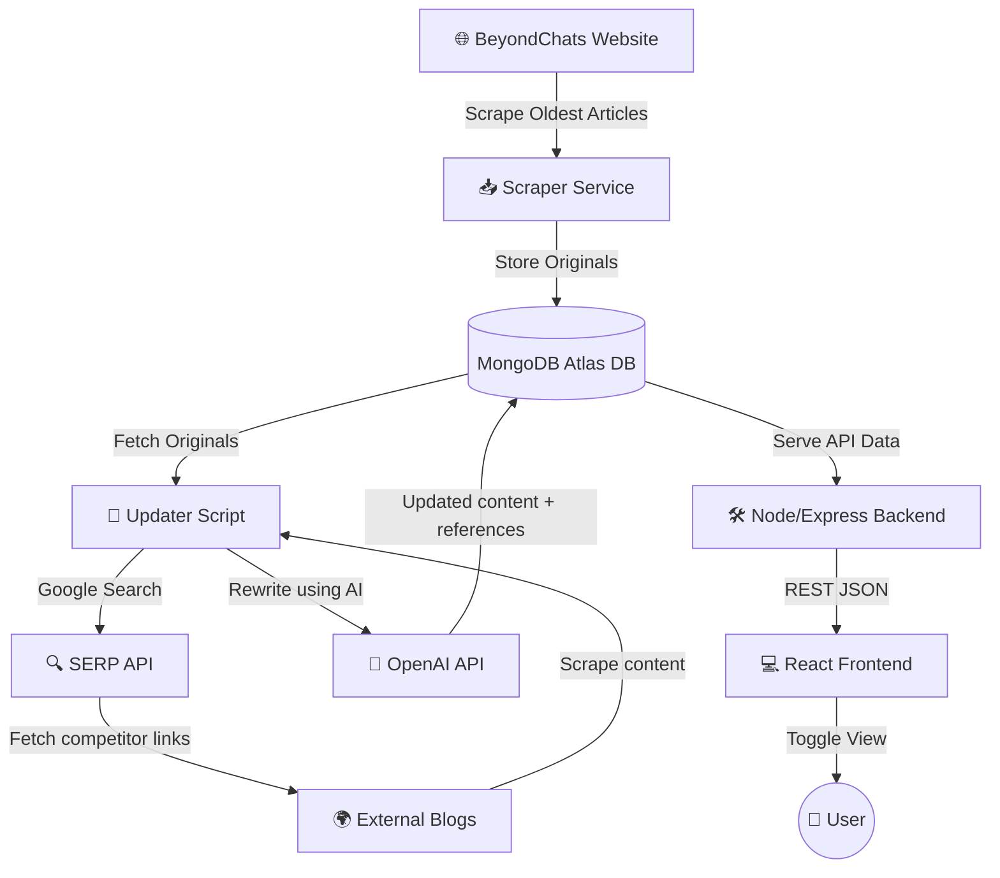

# 🚀 BeyondChat Automation — Automated Article Scraping, Rewriting & Publishing

This project automates the collection of articles from the BeyondChats blog, rewrites them using AI based on top-ranked reference articles, and publishes the updated content — while displaying both original and rewritten versions through a modern UI.
## 📌 Live Demo

| Component | Live URL |
|-----------|----------|
| **Frontend UI** | [Live-Preview](https://beyondchat-automation-1.onrender.com) |
| **Backend API** | [https://beyondchat-automation.onrender.com/api/articles](https://beyondchat-automation.onrender.com) |
| **Database** | MongoDB Atlas |

---

## 🎯 Project Goals

- Scrape the **oldest blog articles** from BeyondChats.
- Automatically **fetch top-ranked Google search competitor content**.
- Use AI to **rewrite & enhance articles** based on reference content.
- Publish the improved articles into the same system.
- Display **Original vs Updated articles** in a responsive UI.

---

## ✨ Key Features

| Feature | Description |
|--------|-------------|
| 📰 Scrapes BeyondChats articles (oldest 5) | Automatically fetches the five oldest blog posts from BeyondChats to build the initial dataset. |
| 🔗 Fetches top-ranking competitor articles via Google Search | Searches article titles on Google and collects the first 1–2 relevant sources for comparison and rewriting. |
| ✍️ Uses AI to rewrite content referencing competitor structure | Sends original + competitor article content to an LLM to generate an improved, SEO-friendly rewritten version. |
| 📌 Stores original & updated versions in MongoDB | Saves both raw and rewritten versions in a single document, allowing comparison and version history. |
| 🔄 Auto-rewrite button in UI | Lets users trigger rewriting of all articles directly from the frontend without running scripts manually. |
| 👀 Toggle `Show Original / Show Updated` | Users can switch between the original scraped article and the AI-generated enhanced version in one click. |
| 📚 References stored & shown below updated version | The rewritten article includes source links from competitor blogs, displayed for transparency and citation. |
| 📏 `View More / View Less` toggle for long articles | Automatically collapses articles longer than 100 words and expands them on demand for clean readability. |
| 📱 Responsive frontend UI with smooth animations | Fully responsive React UI featuring gradient styling, hover effects, and animated buttons for modern UX. |


---

# 🏗️ Architecture / Data Flow Diagram



##  🛠 **Local Development Setup**

Follow these steps to run the entire project locally — backend, scraper, updater, and UI.

### **1️⃣ Clone Repository**
```bash
git clone https://github.com/YOUR-USERNAME/beyondchat-automation.git
cd beyondchat-automation
```

### **2️⃣ Start MongoDB Locally**

| OS | Command |
|----|--------|
| 🪟 Windows | `net start MongoDB` |
| 🍏 macOS | `brew services start mongodb-community` |

MongoDB default URL:
```
mongodb://localhost:27017/beyondchats
```

### **3️⃣ Backend Setup (Server ⚙️)**
```bash
cd server
npm install
```

Create `.env` inside `/server`:
```
PORT=5000
MONGO_URI=mongodb://localhost:27017/beyondchats
```

Run backend:
```bash
npm start
```

Backend URL:
```
http://localhost:5000
```

### **4️⃣ Scrape Articles**
```bash
cd server
npm run scrape
```

### **5️⃣ Updater Setup (Rewrite Engine 🤖)**
```bash
cd updater
npm install
```

Create `updater/.env`:
```
API_URL=http://localhost:5000/api/articles
OPENAI_API_KEY=your_key_here
SERP_API_KEY=your_serp_api_key_here
```

Run updater:
```bash
node update-articles.js
```

### **6️⃣ Frontend UI Setup (React 💻)**
```bash
cd client
npm install
```

Create `client/.env`:
```
REACT_APP_API_URL=http://localhost:5000/api/articles
```

Run UI:
```bash
npm start
```

Frontend URL:
```
http://localhost:3000
```

### **7️⃣ Local Verification Checklist**

| Component | How to Run / URL | Expected Output |
|----------|------------------|----------------|
| 🛠 Backend API | http://localhost:5000/api/articles | JSON list of articles |
| 💻 Frontend UI | http://localhost:3000 | Original & Updated articles with toggle |
| 🤖 Updater Script | node update-articles.js | ✨ Updated version generated and saved |
| 🗄 Database | MongoDB Compass → mongodb://localhost:27017/beyondchats | Articles stored with updatedVersion |

---------------------------------------------------------------------

## 🌍 **Deployment Instructions (Summary)**

Deploy backend on Render:
```
Root Directory: server
Build Command: npm install
Start Command: npm start
```

Render environment variables:
```
MONGO_URI=mongodb+srv://<username>:<password>@cluster.mongodb.net/beyondchats
PORT=10000
```

Deploy frontend on Render/Vercel:
```
Root Directory: client
```

---------------------------------------------------------------------

##  📚 **API Endpoints**

| Method | Endpoint | Description |
|--------|----------|-------------|
| GET | `/api/articles` | List all articles |
| POST | `/update-articles` | Rewrite & update all articles |
| GET | `/api/articles/:id` | Show a single article |
| PUT | `/api/articles/:id` | Update any version |
| DELETE | `/api/articles/:id` | Remove article |

---------------------------------------------------------------------

 ##  🎨 **UI Highlights**

- ✨ Modern gradient + glassmorphism UI
- 🌀 Smooth hover animations
- 🔀 Toggle Original/Updated versions
- 📖 “View More / View Less” collapsible content
- 📚 Reference links shown under updated content

---------------------------------------------------------------------

##  🚧 **Known Limitations**

| Issue | Reason | Planned Fix |
|-------|--------|-------------|
| ❌ Medium scraping blocked | Medium blocks bots | Proxy / scraper API |
| ⚠️ OpenAI rate limits | Free quota small | Add billing / switch models |
| 🐢 Rewrite uses many tokens | Long articles | Delay or cron rewrite |

---------------------------------------------------------------------

## 🚀 **Roadmap**

- [ ] Rewrite single article from UI
- [ ] Daily rewrite automation via cron job
- [ ] SEO quality scoring
- [ ] Export updated content to Markdown/Notion
- [ ] UI search, filters, and tags

---------------------------------------------------------------------

## 🤝 **Contributing**

PRs & issues welcome!

---------------------------------------------------------------------

⭐ **If this project helped you, please star the repository!**


