# 🚀 BeyondChat Automation — Automated Article Scraping, Rewriting & Publishing

This project automates the collection of articles from the BeyondChats blog, rewrites them using AI based on top-ranked reference articles, and publishes the updated content — while displaying both original and rewritten versions through a modern UI.
## 📌 Live Demo

| Component | Live URL |
|-----------|----------|
| **Frontend UI** | https://YOUR-CLIENT-URL.onrender.com |
| **Backend API** | https://beyondchat-automation.onrender.com/api/articles |
| **Database** | MongoDB Atlas |

---

## 🎯 Project Goals

- Scrape the **oldest blog articles** from BeyondChats.
- Automatically **fetch top-ranked Google search competitor content**.
- Use AI to **rewrite & enhance articles** based on reference content.
- Publish the improved articles into the same system.
- Display **Original vs Updated articles** in a responsive UI.

---

## ✨ Key Features

| Feature | Description |
|--------|-------------|
| 📰 Scrapes BeyondChats articles (oldest 5) |
| 🔗 Fetches top-ranking competitor articles via Google Search |
| ✍️ Uses AI to rewrite content referencing competitor structure |
| 📌 Stores original & updated versions in MongoDB |
| 🔄 Auto-rewrite button in UI |
| 👀 Toggle `Show Original / Show Updated` |
| 📚 References stored & shown below updated version |
| 📏 `View More / View Less` toggle for long articles |
| 📱 Responsive frontend UI with smooth animations |

---

# 🏗️ Architecture / Data Flow Diagram

```mermaid
flowchart TD

A[🌐 BeyondChats Website] -->|Scrape Oldest Articles| B[📥 Scraper Service]
B -->|Store Originals| C[(MongoDB Atlas DB)]

C -->|Fetch Originals| D[🧠 Updater Script]
D -->|Google Search| E[🔍 SERP API]
E -->|Fetch competitor links| F[🌍 External Blogs]
F -->|Scrape content| D

D -->|Rewrite using AI| G[🤖 OpenAI API]
G -->|Updated content + references| C

C -->|Serve API Data| H[🛠️ Node/Express Backend]
H -->|REST JSON| I[💻 React Frontend]
I -->|Toggle View| User((👤 User))

```

🛠 Local Development Setup

Follow these steps to run the entire project locally — backend, scraper, updater, and UI.

1️⃣ Clone Repository
git clone https://github.com/YOUR-USERNAME/beyondchat-automation.git
cd beyondchat-automation

2️⃣ Start MongoDB Locally

Windows:
net start MongoDB

macOS:
brew services start mongodb-community

MongoDB default URL:
mongodb://localhost:27017/beyondchats

3️⃣ Backend Setup (server)

cd server
npm install

Create .env inside /server:
PORT=5000
MONGO_URI=mongodb://localhost:27017/beyondchats

Run server:
npm start

Backend is live at:
http://localhost:5000

4️⃣ Scrape Articles

Fetch original BeyondChats articles into DB:
cd server
npm run scrape

5️⃣ Updater Setup (rewrite engine)
cd updater
npm install

Create updater/.env:

API_URL=http://localhost:5000/api/articles
OPENAI_API_KEY=your_key_here
SERP_API_KEY=your_serp_api_key_here

Run updater:
node update-articles.js

This generates & saves updated versions using AI.

6️⃣ Frontend UI Setup
cd client
npm install

Create client/.env:
REACT_APP_API_URL=http://localhost:5000/api/articles

Run UI:
npm start

Frontend:
http://localhost:3000
7️⃣ Local Verification Checklist

| Component          | How to Run / URL                                                              | Expected Output                                                   |
| ------------------ | ----------------------------------------------------------------------------- | ----------------------------------------------------------------- |
| **Backend API**    | `http://localhost:5000/api/articles`                                          | JSON list of articles                                             |
| **Frontend UI**    | `http://localhost:3000`                                                       | Original & Updated articles visible with toggle                   |
| **Updater Script** | `node update-articles.js`                                                     | `✨ Updated version generated and saved` message in terminal       |
| **Database**       | Open **MongoDB Compass** → connect to `mongodb://localhost:27017/beyondchats` | Articles collection with both `content` + `updatedVersion` fields |

🌍 Deployment Instructions (Summary)
| Component | URL                                                                      | Expected                                |
| --------- | ------------------------------------------------------------------------ | --------------------------------------- |
| Backend   | [http://localhost:5000/api/articles](http://localhost:5000/api/articles) | JSON article list                       |
| UI        | [http://localhost:3000](http://localhost:3000)                           | Original + Updated articles             |
| Updater   | `node update-articles.js`                                                | "✨ Updated version generated and saved" |
| DB        | MongoDB Compass                                                          | Both versions stored                    |

When deploying, place Atlas URL in Render env:
MONGO_URI=mongodb+srv://<username>:<password>@cluster.mongodb.net/beyondchats
PORT=10000

📚 API Endpoints

| Method | Endpoint            | Description                       |
| ------ | ------------------- | --------------------------------- |
| GET    | `/api/articles`     | List all articles                 |
| POST   | `/update-articles`  | Rewrite & update all articles     |
| GET    | `/api/articles/:id` | Show a single article             |
| PUT    | `/api/articles/:id` | Update original / updated version |
| DELETE | `/api/articles/:id` | Remove article                    |

🎨 UI Highlights

Glassmorphism & gradient theme
Hover animations for cards
Toggle button with dynamic styling
Collapsible long text ("View More / View Less")
Reference links shown under updated content

🚧 Known Limitations
| Issue                         | Reason             | Planned Fix                 |
| ----------------------------- | ------------------ | --------------------------- |
| Medium scraping blocked (403) | Medium blocks bots | Proxy / RSS / scraper API   |
| OpenAI rate limits            | Free quota small   | Add billing / switch models |
| Batch rewriting heavy         | Many tokens        | Delay / cron automation     |

🚀 Roadmap
 Rewrite single article from UI
 Auto daily rewrite via cron job
 SEO score comparison
 Export updated content to Markdown / Notion
 UI search + filters

